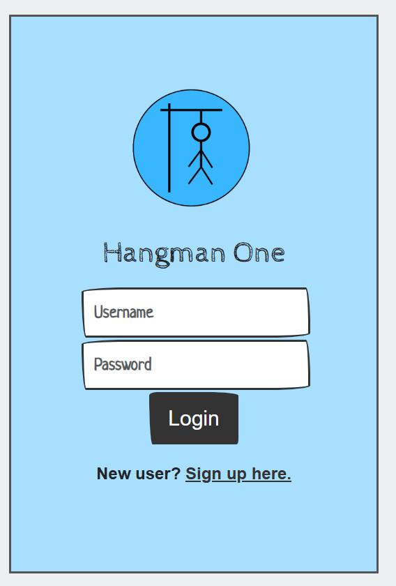
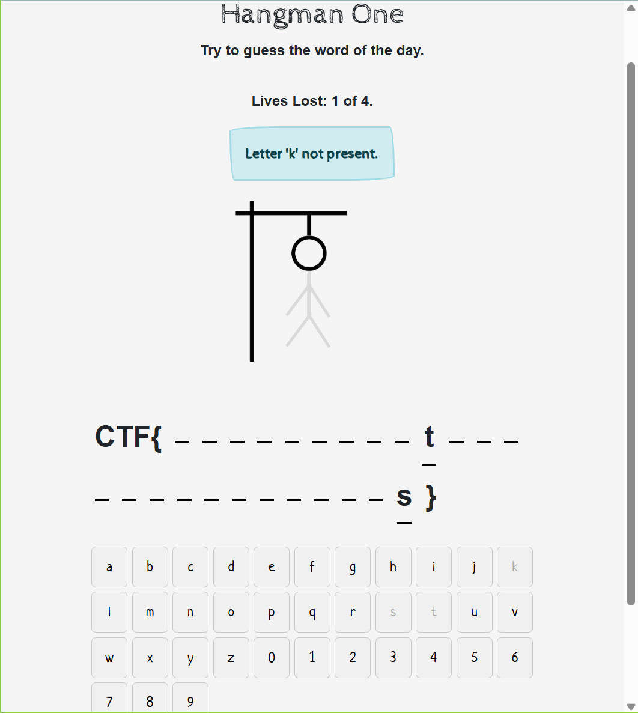

# BSidesSF 2025 CTF

---

Contributed by A.Tao

# toothless - 100 / Forensics, 101

---

> This packet capture seems convoluted. Is it?  
> Author: anshc  
> [toothless.pcap](toothless.pcap)
> 

## Soultion

---

- 使用WireShark開啟toothless.pcap後在Packer List中發現都是ICMP的封包，其中57號封包被標示 (no response found!)。
- 觀察57號封包的Packet Bytes View，發現有個可疑字串：”Q1RGe3kwdV91czNsM3NzX3IzcHQxbDN9”。
- 將發現的字串進行 Base64解碼 ([https://www.dcode.fr/base-64-encoding](https://www.dcode.fr/base-64-encoding))，可得flag: CTF{y0u_us3l3ss_r3pt1l3} 。
- Done.

# **hangman-one - 100 / Web, 101**

---

> Play hangman and guess the flag  
> Author: itsc0rg1  
> [https://hangman-one-a7344a19.challenges.bsidessf.net/](https://hangman-one-a7344a19.challenges.bsidessf.net/)
> 

## Solution

---

- 網站的初始畫面如下圖，Sign Up一個帳號。
    
    
    
- 登入後畫面如下圖，CTF{ }裡面有25個未知字元，可從下面的英數文字按鈕猜測未知字元。若所按的字元為flag的一部分，則在flag正確的位置上會出現該字元，猜錯4個字元，這個遊戲便結束。若要replay則需要重新Sign Up.
    
    
    
    
    
- 將每回合獲得的CTF{…}字串疊合，如下：  
CTF{h----4----H------5----0--}  
CTF{hang--n---h---en--an--0--}  
CTF{hang-4n---h---en-5an--0--}  
CTF{----m------f----d---df---}  
CTF{hangm4n---hf--end5andf0--}  
CTF{-------w1---r1---------3s}  
CTF{hangm4nw1thfr1end5andf03s}  
- 最終可得flag: CTF{hangm4nw1thfr1end5andf03s}。
- Done.

# Reference

---

- None
