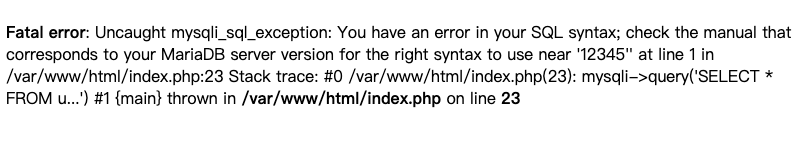

# CTF@CIT - 2025
###### Contributed by @CXPhoenix
###### credits to @scott987

## Breaking Authentication

> [!NOTE]
> 
> Challenge Description
> 
> "Say my username."
> 
> **Note**: this challenge instance will reset every 15 minutes. If a challenge is not responsive, you might need to wait until the next quarter hour.

### Solution

進場看到登入畫面，再結合上 Breaking Authentication 說明，直接先猜這是 `SQL Injection` ，果不其然，使用 `'` 戳出 500，順便還確認了這是 MariaDB 呢！

然後就衝一波，使用 `' OR 1=1;-- -`，成功登入後就被嘲笑了...根本不在這...。

總之不信邪的我試了超級久的 `SQLi` 的攻擊法，沒什麼結論...。

> [!WARNING]
> 
> 原來是被禁止的...
> 
> 被哲雋提醒，其實若沒有特別說，SQL MAP 或 Dirsearch 這種東西是不可以使用的...
>
> 只好自己勤勞點建一些字典檔和寫一些 exploit 起來使用了 0(:3　)～ ('､3_ヽ)_

中間我還是有偷用 `dirsearch` 掃啦...掃到 cgi-bin，原本想說是不是有用，但是事實證明這是一個看起來有洞的黑色圈圈而已...

試到沒辦法...剛好就坐高鐵回台北呵呵。

到家還是不甘心，繼續測試後...不開心的我就乾脆寫 exploit 去爆他的資料庫（你看還不是要爆 ｡ﾟヽ(ﾟ´Д`)ﾉﾟ｡ ）

由於是在不開心的狀態下寫，因此 code 沒有良好的保存步驟...這邊說明一下我在得到結果之前所做的測試：

1. 利用 UNION-based 測定 column 數量 (為 4)
2. 利用 LIKE 確認 目標 table (table_name 為 secrets)
3. 利用 LIKE 確認 `secrets` 有哪些 column (確認為 name, value)
4. 利用 LIKE 確認 目標的 `name` (為 `flag`)

總之，最後使用 `Blind SQLi` 的 `Wildcard Injection` 技巧，利用 LIKE 測試出 Flag `CIT{36B0EFD6C2EC7132}`。

---
### Referenece
