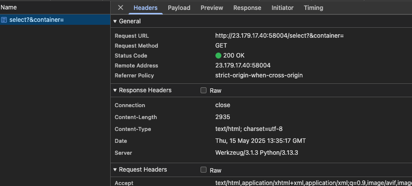
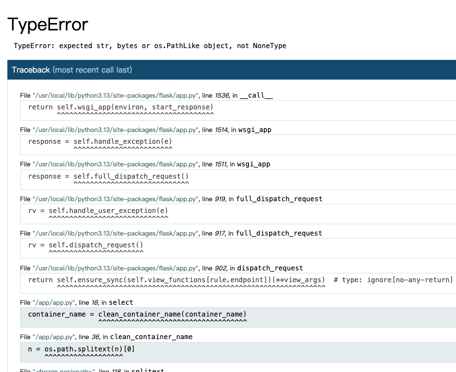
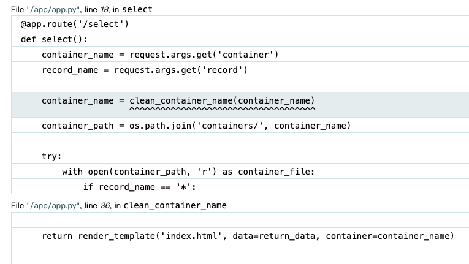
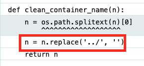

# CTF@CIT - 2025
###### Contributed by @CXPhoenix

## How I Parsed your JSON - 868 / Web

> [!NOTE]
> 
> Challenge Description
> 
> "This is the story of how I defined your schema."
> 
> The flag is in secrets.txt
> 
> **Note**: this web challenge instance will reset every 30 minutes. If a challenge is not responsive, you might need to wait until the next half hour.

### Solution

剛看到這個題目時，我看到他是 `SELECT` ，結合上他說的 `schema` ，直接用 `SQL Injection` 手法 `'` 下去測。測完一則以喜一則以憂：喜的是確認不是 `SQL Injection`，直接判他出局；憂的是...還不知道攻擊點。

稍微看過 Network 流量紀錄後，我看到了以下圖片資訊：

注意到 `Werkzeug/3.1.3 Python/3.13.3` ，基本上可以判定這是 Python 的 Application Server 出來的東西，而且框架應該是 `Flask`。既然如此，那就開始要戳出 500 才行。

注意到搜尋時， URL 會改變為 `/select?record=&container=` 後，決定直接清掉 query，因為這通常會觸發 500。果不其然就快樂出現了 (*´▽`*) 。

首先點開了他的部分錯誤，看到了裡面的~~可愛~~東西，發現他是用 `os.path.join` 來拼接。哈...原來是 Path Traversal 嗎...

再往下一看，發現：喔～原來他會過濾掉 `dot-dot-slash` 攻擊啦！

恩...只擋一次...

所以只要用 `....//` 就可以 bypass 過 `../` 的限制了！

接著還剩下副檔名的問題，往上一看，發現它呼叫了 `os.path.splittext` 來分割檔名和副檔名。如果我喂進 `secret.txt` ，那他也只能拿到 `secret` 當作檔案名稱。那...我就再加副檔名就可以 bypass 了呵呵。

把前面的 `....//` 加上 `secrets.txt.t` ，組出最終的 Payload：`....//secrets.txt.t`。直接把它塞到題目要求的參數裡，構造出完整的請求 `/select?record=*&container=....//secrets.txt.t`。

然後就得到 Flag ：`CIT{235da65aa6444e27}`。

---
### Reference