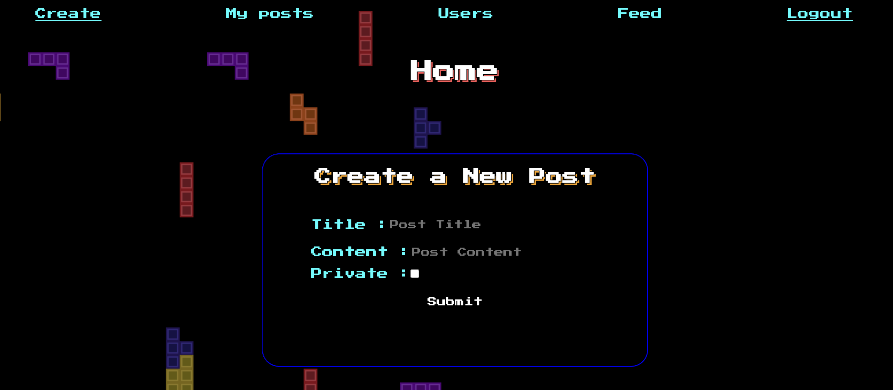
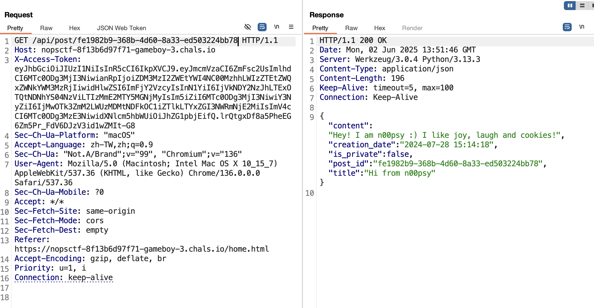
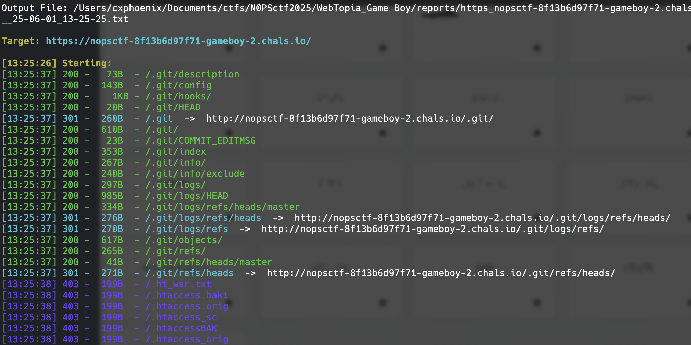
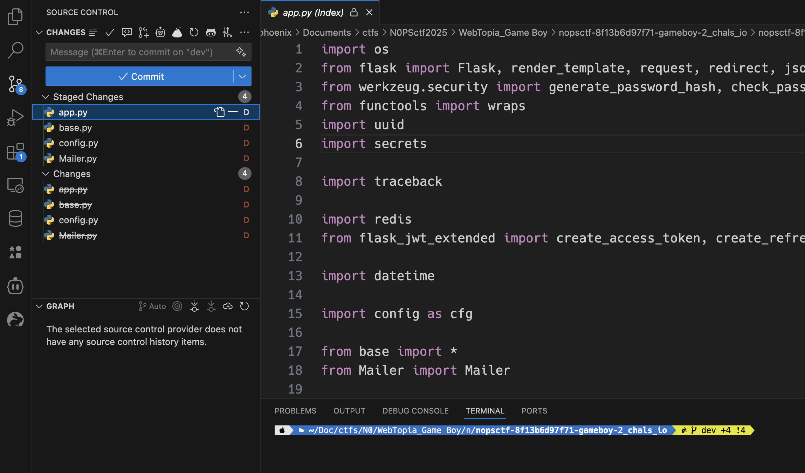
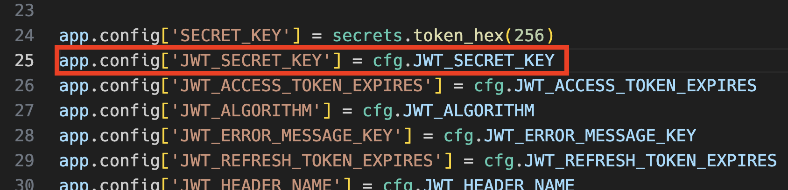
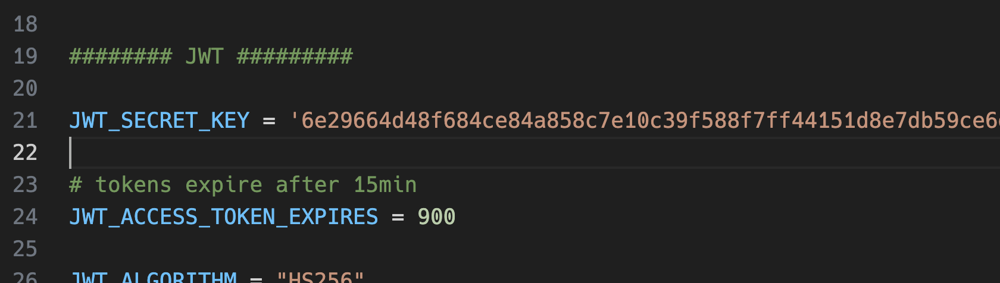
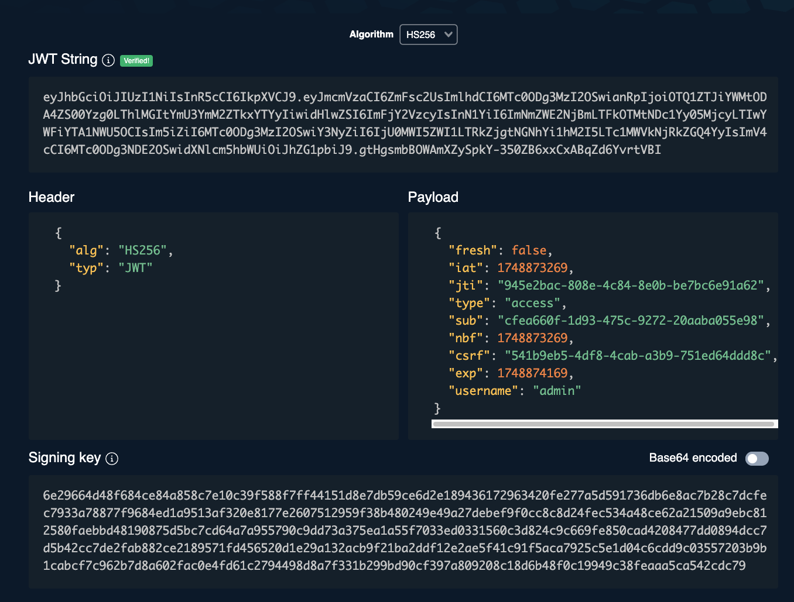
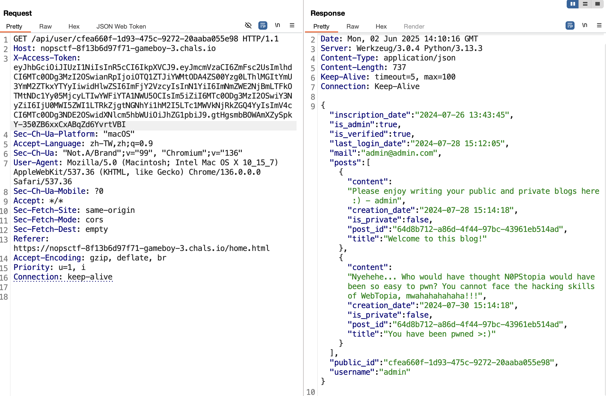

# N0PSctf - 2025
###### Contributed by @CXPhoenix

## Game Boy

> [!NOTE]
> Value: 493
>
> Author algorab, Sto

### Description
Hey!! We have a small problem... We deployed a blog application for N0PStopians, and we got hacked by WebTopia! Can you find how they did this?

### Solution

> [!TIP]
> 本題真的是...花了我不少冤望時間...主要是在浪費時間測試根本沒有意義的東西ＱＷＱ
>
> 結果最後還是忍不住用 dirsearch 一掃，哇...竟然是 git leakage...
>
> 讓人覺得「我前面到底在幹嗎..」 ◢▆▅▄▃崩╰(〒皿〒)╯潰▃▄▅▇◣

一開始進入時，發現這是一個註冊的畫面，理所當然的就測了一下 SQL Injection。

結論是當然沒有東西 ╮(╯_╰)╭

然後開始翻閱原始碼，發現他有往後端去 call API，測了幾個後確認應該要先註冊才行。

因此我就先註冊並登入。(以下為登入後的介面)

登入之後就開始看看各個選項會 call 的內容。

* Create > submit --> POST `/api/post/write`
* My posts        --> GET `/api/user/5d46672a-1194-43aa-875b-232a61690cc3`  << 我研判是 user id
* Users           --> GET `/api/users`
* Feed            --> GET `/api/feed`

這時我靈光一閃，既然有 `/api/user/...` 這個 endpoint，而且也可以透過 `/api/feed` 看到所有文章，那麼是不是有可能有一個可以只讀特定文章的 api endpoint?

按照工程邏輯，那應該就是 `/api/post/{post_id}` 了吧？

然後果然在從 `/api/feed` 那邊拿到的 post_id 喂進去後，在 `/api/post/fe1982b9-368b-4d60-8a33-ed503224bb78` 得到文章。

之後就在無限測試後...沒有然後了 _(┐「﹃ﾟ｡)_

---

經過了很長的測試後，我還是忍不住用 dirsearch 掃了一下（想說是另外開的 instance，應該...撐得住吧..?）

一掃..早知道就先把 dotGit 工具打開了 (°ཀ°)

知道是 git 洩漏就好辦了，打開 dotGit，下載洩漏的部分，然後解壓縮用 vscode 打開，並且查閱他的 git 相關內容。

這邊也花了點時間檢查，發現雖然他的 debug 模式開著，但是我刻意戳 api 的 500，卻沒有正常的顯示出 debug error 的內容，回頭查看了一下 branch ，發現他的 branch 很有趣，竟然是 `dev`，而不是傳統上使用的 `main` 或 `master`。所以這邊我決定看一下他的 branch 還有哪些。

一看發現果然有 master

毅然決然地切換過去，重新查看後，發現在 `app.py` 中的 `JWT_SECRET_KEY` 是屬於 hard code 的，然後就去翻閱 `config.py` 找到他的 `JWT_SECRET_KEY` 就能成功地去修改 JWT Token 了。

接著當然就是直接改 jwt 來打穿囉！

這邊我使用 [token.dev](https://token.dev/) 來進行 jwt token 的修改。

然後就拿新的 token 去打，測試了 `/api/user/cfea660f-1d93-475c-9272-20aaba055e98` 並沒有結果...

**但是**，還有另一個 user 還沒測，於是測試了 `/api/user/7a0dfc65-5890-4b54-a79b-c05dfce52c7d` 後，就成功拿到 flag 了！

> [!IMPORTANT]
> flag: **N0PS{d0t_G17_1n_Pr0DuC710n?!!}**

### Referenece

* [Chrome Extension: dotGit](https://chromewebstore.google.com/detail/dotgit/pampamgoihgcedonnphgehgondkhikel?hl=zh-TW&utm_source=ext_sidebar)